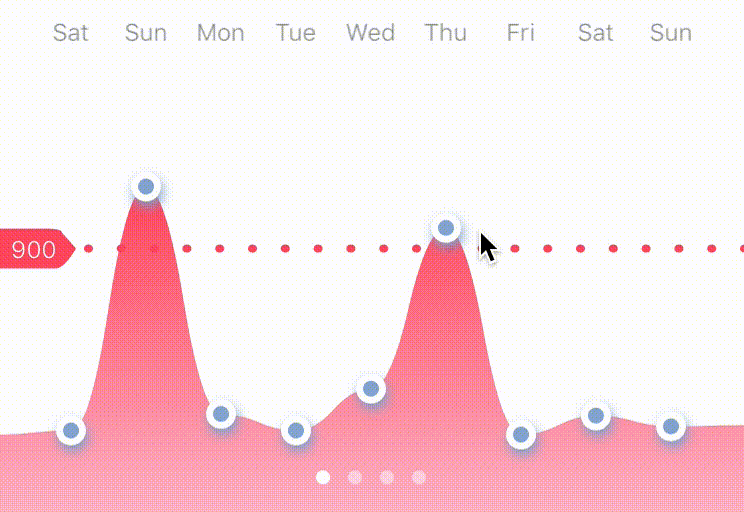
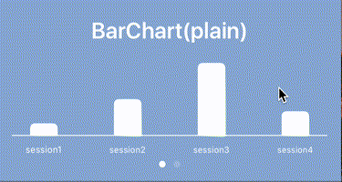
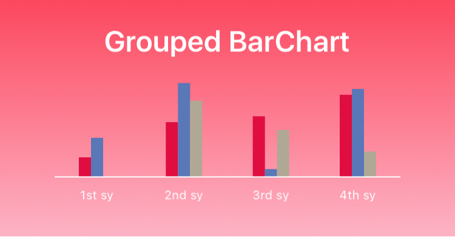
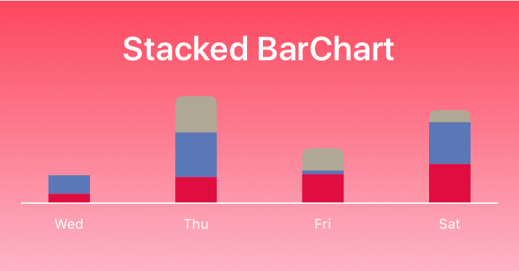
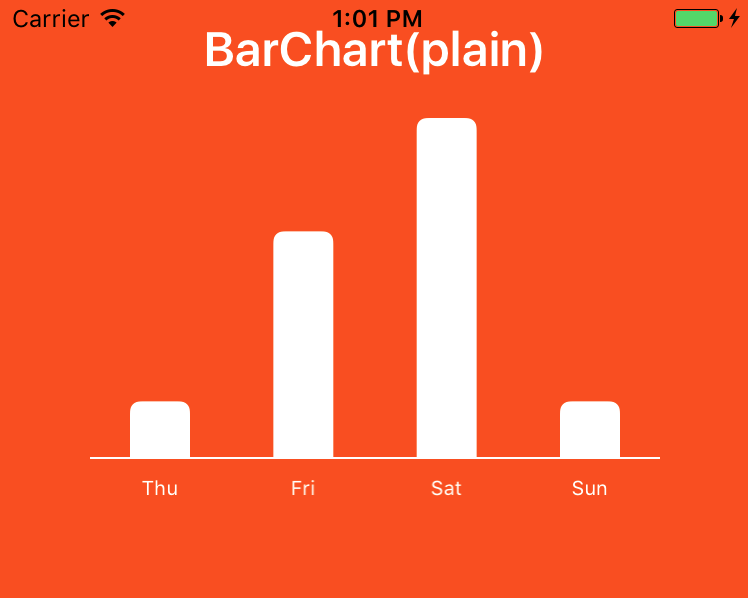

# HamsterUIKit
A simple and elegant UIKit(Chart) for iOS, written in Swift.

:bar_chart: Curve and bar Charts.   
:bulb: Protocols are designed based on UIKit(UITableView).  
:keycap_ten: Draw a complex but elegant graph in 10 minutes.

<p align="center">


</p>

## Protocols
### Initialize and reload
| UITableView     | HamsCurveChart | HamsBarChart |
| :---            |     :---:      |          :---: |
| init(frame: CGRect)   | same     | same    |
| init?(coder aDecoder: NSCoder)   | same     | same    |
| reloadData   | same     | same    |

### DataSource
| UITableView     | HamsCurveChart    | HamsBarChart      |
| ---            | ---            | ---            |
| numberOfSections(in tableView: UITableView) -> Int   | numberOfCharts(in curveChart: HamsCurveChart) -> Int | numberOfCharts(in barChart: HamsBarChart) -> Int|
| tableView(_ tableView: UITableView, cellForRowAt indexPath: IndexPath) -> UITableViewCell | curveChart(_ curveChart: HamsCurveChart, pointForChart indexPath: HamsIndexPath) -> HamsCurveChartPoint | barChart(_ barChart: HamsBarChart, barForChart indexPath: HamsIndexPath) -> HamsBarChartRect |
| tableView(_ tableView: UITableView, numberOfRowsInSection section: Int) -> Int | curveChart(_ curveChart: HamsCurveChart, numberOfValuesInChart chart: Int) -> Int | barChart(_ barChart: HamsBarChart, numberOfValuesInChart chart: Int) -> Int|

### Delegate
|HamsCurveChart | HamsBarChart |
|     :---      |          :--- |
| curveChart(_ curveChart: HamsCurveChart, configureForCharts chart: Int)     | barChart(_ barChart: HamsBarChart, configureForCharts chart: Int)    |


## Installation

### CocoaPods
1. Add to your Podfile:
``` 
use_frameworks!
pod 'HamsterUIKit'
```
2. Type in terminal:
```
pod install
```
3. Import the framework
```
import HamsterUIKit

### Manually 

``` sh
git clone https://github.com/Haneke/HanekeSwift.git
```
0. Copy and paste the above command in your terminal, it will clone the repo into your disk.
1. Drag `HamsterUIKit.xcodeproj` to your project in the _Project Navigator_.
2. Select your project and then your app target. Open the _Build Phases_ panel.
3. Expand the _Target Dependencies_ group, and add `HamsterUIKit.framework`.
4. Click on the `+` button at the top left of the panel and select _New Copy Files Phase_. Set _Destination_ to _Frameworks_, and add `HamsterUIKit.framework`.
5. `import HamsterUIKit` whenever you want to use Haneke.


## Demo
[Bar Chart Demo](https://github.com/ChromieIsDangerous/HamsterUIKit/blob/master/HamsterUIKitExample/BarChartViewController.swift)

[Curve Chart Demo](https://github.com/ChromieIsDangerous/HamsterUIKit/blob/master/HamsterUIKitExample/HamsCurveChartController.swift)

## Advanced Configuration
### Bar Chart


## Bar Chart Quick start
<p align="center">
</p>

```swift
import UIKit
import HamsterUIKit

class HelloBarChartViewController: UIViewController, HamsBarChartDelegate, HamsBarChartDataSource {
	var barChart:HamsBarChart = HamsBarChart()
	var dataSets = [CGFloat]()
    override func viewDidLoad() {
        super.viewDidLoad()
		barChart = HamsBarChart(frame: CGRect(x: 0, y: 0, width: view.frame.width, height: 300))

		barChart.delegate = self
		barChart.dataSource = self
		view.addSubview(barChart)
    }

	func barChart(_ barChart: HamsBarChart, numberOfValuesInChart chart: Int) -> Int {
		return dataSets.count
	}

	func numberOfCharts(in barChart: HamsBarChart) -> Int {
		return 1
	}

	func barChart(_ barChart: HamsBarChart, barForChart indexPath: HamsIndexPath) -> HamsBarChartRect {
		let rect = HamsBarChartRect()
		rect.value = .plain(dataSets[indexPath.column])
		rect.color = .plain(.white)
		return rect
	}

	override func viewWillAppear(_ animated: Bool) {
		super.viewWillAppear(animated)
		dataSets = [1,4,6,1]
		barChart.reloadData()
	}

	func barChart(_ barChart: HamsBarChart, configureForCharts view: Int) {

		barChart.title = "BarChart(plain)"
	}
    override func didReceiveMemoryWarning() {
        super.didReceiveMemoryWarning()
    }
}
```

## Todo
Advanced Configuration

## Created By:
Howard Wang - [Hire me](https://www.linkedin.com/in/jiongzhi-wang-a32483132/)

[Zhiye Jin](http://www.zhiye-jin.com)(UI Designer)

Healthy Fridge Project - [Hamster Fridge Management](https://itunes.apple.com/us/app/hamster-fridge-management/id1227220933?mt=8)

## License
HamsterUIKit is Copyright (c) 2017 Howard Wang and released as open source under the attached [Apache 2.0 license](https://github.com/ChromieIsDangerous/HamsterUIKit/blob/master/LICENSE).

THE SOFTWARE IS PROVIDED "AS IS", WITHOUT WARRANTY OF ANY KIND, EXPRESS OR IMPLIED, INCLUDING BUT NOT LIMITED TO THE WARRANTIES OF MERCHANTABILITY, FITNESS FOR A PARTICULAR PURPOSE AND NONINFRINGEMENT. IN NO EVENT SHALL THE AUTHORS BE LIABLE FOR ANY CLAIM, DAMAGES OR OTHER LIABILITY, WHETHER IN AN ACTION OF CONTRACT, TORT OR OTHERWISE, ARISING FROM, OUT OF OR IN CONNECTION WITH THE SOFTWARE OR THE USE OR OTHER DEALINGS IN THE SOFTWARE.
